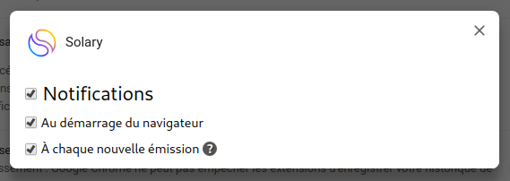

# Settings

Library provide an easy way to integrate settings to your web extension through an [Options page](https://developer.chrome.com/extensions/options).

:::tip
Since it uses [Sync storage](../browser-features/sync-storage.md), you should update your extension permissions, edit your `manifest.json` with:

```json
{
  "permissions": ["storage"]
}
```
:::

## Definition

Your settings must match `InterfaceSettings` interface:

```typescript
export interface InterfaceSettings {
  [k: string]: InterfaceSettingsItem;
}

export interface InterfaceSettingsItem {
  type: 'boolean'; // for it only supports boolean
  label: string;
  help?: string;
  defaultValue?: any;
  value?: any;
  children?: InterfaceSettings;
}
```

Here is an example of settings from a web extension which uses sounds, [notifications](../browser-features/notifications.md), and [Twitch helper](./twitch.md):

:::warning
We highly recommend to define your settings in a single file, `src/settings.ts` for example.
:::

```typescript
// src/settings.ts

import { InterfaceSettings } from '@kocal/web-extension-library';

export default {
  // -- Simple setting
  // Should we play sounds?
  playSounds: {
    type: 'boolean',
    label: 'Play sounds',
    defaultValue: false,
  },
  
  // -- If your setting is more complex, you can use `children` object
  // Should we display any notifications ?
  showNotifications: {
    type: 'boolean',
    label: 'Notifications',
    defaultValue: true,
    children: {
      
      // Show notifications at browser boot?
      atBoot: {
        type: 'boolean',
        label: 'At browser boot',
        defaultValue: true,
      },
     
     // Show notifications when a stream updates its title?
      onTitleUpdate: {
        type: 'boolean',
        label: 'At each show',
        help: 'Display a notification when a stream updates its title',
        defaultValue: false,
      },
    },
    
  },
} as InterfaceSettings;
```

Depending of how you handle your options page, this is what [Solary](https://github.com/Kocal-Web-Extensions/Solary) french extension displays:



_Note: Solary only use settings for notifications._

## Registration

Before using your settings, you must register them with `regiterSettings`.

A call to `loadSettings()` is automatically made to retrieve settings from [Sync storage](../browser-features/sync-storage.md).

In your options page:

```typescript
import { registerSettings } from '@kocal/web-extension-library';
import settings from './path/to/your/settings.ts';

registerSettings(settings)
  .then(() => {
    // Display your settings interface
  })
  .catch(error => {
    console.error(error);
  });
```

For example, this is how Solary implements its settings interface with [Vue.js](https://vuejs.org):

```vue
<template>
  <div>
    <template v-if="loading">
      Loading parameters...
    </template>
    <template v-else-if="error">
      {{ error.message }}
    </template>
    <template v-else>
      <!-- Component which renders settings tree -->
      <settings :settings="settings"/>
    </template>
  </div>
</template>

<script>
import { registerSettings, getSettings, setSettingValue } from '@kocal/web-extension-library';
import settings from '../store/settings';

export default {
  components: { Settings },
  data: () => ({
    settings: {},
    loading: true,
    error: null,
  }),
  created() {
    registerSettings(settings) // will hydrate `settings` object
      .then(() => {
        this.loading = false;
        this.$set(this, 'settings', getSettings());

        // update some settings, it will synchronize them with sync storage...
        setSettingValue('showNotifications', true)
          .then(() => console.log('success'));
          
        setSettingValue('showNotifications.onTitleUpdate', true)
          .then(() => console.log('success'));
      })
      .catch(error => {
        this.error = error;
        this.loading = false;
      });
  },
};
</script>
```

## Usage

If you want to use your settings in an other page than `options` (e.g.: `background`),
you **should** import and register your settings _again_, because it's possible that your options page has 
never been opened and your settings are not synchronized yet.

:::warning
The method `registerSettings` should be called only one time per page (`options` and `background`).
:::

:::warning
If your background runs an interval (e.g.: fetch some twitch streams each 2 minutes), 
then you **must** load your settings with `loadSettings()` in order to keep them synchronized.
:::

```typescript
// src/background.ts

import { registerSettings, loadSettings, getSettingValue, setSettingValue } from '@kocal/web-extension-library';
import settings from './path/to/your/settings.ts';

registerSettings(settings)
  .then(() => {
    bootBackgroundApp();
  });

function bootBackgroundApp() {
  // do stuff...
  
  setInterval(() => {
      // You MUST call this function at least one time before using settings,
      // in order to keep them synchronized with options page
      loadSettings() 
        .then(() => {
          if (getSettingValue('showNotifications') === true) {
            // Show a notification...
          }
          
          if (getSettingValue('showNotifications.onTitleUpdate') === true) {
            // Show a notification...
          }
        })
  }, 1000 * 60 * 2);
}
```

